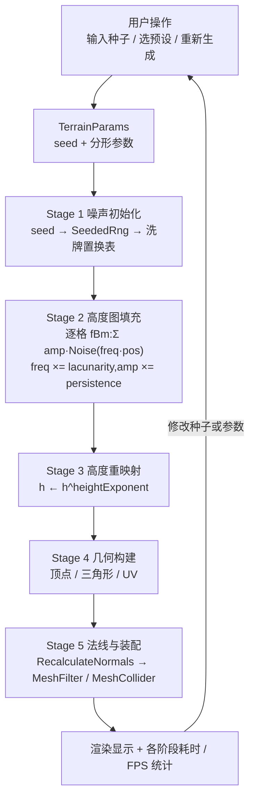
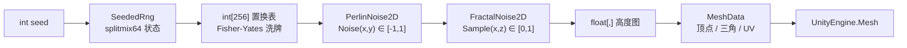

# 程序化地形生成:调研论证与最简实现设计

> 依据:`Docs/Plan/speech-script.md`(Week 4 演讲稿)及其所列文献。配套代码位于 `GHF/Assets/TerrainDemo/`,其中测试文件 `Tests/Editor/TerrainGenTests.cs` 已完整实现,是全部行为契约的"规格说明";其余代码文件为骨架(保留方法名与中文原理注释,实现留空待补)。

## 1. 项目定位与评价标准

演讲稿把项目范围收敛为一句话:做一个**固定范围的程序化山体生成器**。它明确不做体素、洞穴、侵蚀模拟、无限世界和完整玩法,只保留最核心的一条管线——"噪声生成高度图,高度图转成可浏览的网格"。范围收敛的意义在于让评价成为可能,演讲稿据此给出三个维度:**结构保真度**(山脊与山谷是否清晰可辨)、**细节保真度**(不同尺度的表面变化能否自然过渡)、**可控性**(结果能否通过种子精确复现)。

这三个维度不是泛泛的质量描述,而是后文所有设计决策的裁决依据:每选一种噪声、每定一个参数、每划一条范围边界,都应能指出它服务于哪个标准、以什么机制服务。第 4 节的映射表就是这套论证的汇总。

## 2. 学术文献论证

### 2.1 Musgrave et al. (1989):分形地形与频率可控合成

《The Synthesis and Rendering of Eroded Fractal Terrains》做了三件事。其一,提出以噪声函数为基础的地形合成方法,使高度场中各频率成分可以被局部、独立地控制,这打破了早期分形地形"一个公式管到底"的粗粒度;其二,给出 multifractal 等改进模型,缓解标准分形地形"处处自相似"的均质感;其三,把水力侵蚀模拟作用于分形地形,用物理过程换取真实感的显著提升。

对本项目的作用:它奠定了"**地形高度场 = 可控频率成分的叠加**"这一方法论,正是 fBm 分层噪声的理论起点。低频层决定山体大尺度轮廓、高频层叠加表面粗糙度的做法直接来源于此;而侵蚀模拟提示了真实感的更高阶段是物理过程,演讲稿明确将其划出范围——本项目用 fBm 达到"结构与细节兼备"即止,这个取舍有文献依据,不是能力疏漏。

### 2.2 Matsumoto & Nishimura (1998):种子化伪随机性的理论基础

Mersenne Twister 的核心贡献是:伪随机数发生器由**种子(初始状态)**初始化,之后通过完全确定的递推产生超长周期(2^19937−1)、高维均匀的序列。它把"伪随机"的性质说清楚了——伪随机不是真随机,而是一条由种子唯一确定的状态演化轨迹。

对本项目的作用:这是"可控性"标准的理论根基。只要满足三个条件——随机性来源唯一、递推确定、状态只由种子决定——同一种子在任意时刻重放必然得到完全相同的序列,地形复现就自动成立。工程实现上,本项目不引入 MT 本体(624 字状态、初始化较重),而是采用同原理的紧凑发生器 splitmix64(见骨架 `SeededRng.cs`);重要的是性质不变:**种子 → 状态 → 确定性序列**,并且整条管线的一切随机性都收口于这一个来源。

### 2.3 Lagae et al. (2010):噪声函数的分类与取舍

《A Survey of Procedural Noise Functions》对过程噪声做了系统分类(value、gradient(Perlin/Simplex)、sparse convolution、wavelet 等),并给出统一的评价维度:计算成本、带宽、各向同性、平稳性、频谱可控性等。综述确认了两件与本项目直接相关的事:把多个频段加权叠加是构造复杂噪声的标准手段(频谱合成),频率按固定倍率缩放即得到 octaves;不同噪声在速度与质量之间存在明确取舍,格点类梯度噪声(Perlin)以极低成本获得良好的各向同性与频谱可控性。

对本项目的作用:这是底层噪声选型的直接依据。候选方案逐一对照:Unity 自带的 `Mathf.PerlinNoise` 不可播种,种子无法进入噪声内部,可控性不达标;value 噪声实现最简,但网格伪影明显,损害细节保真;**自实现经典 Perlin 梯度噪声**——由种子把 256 项置换表洗牌,再在其上计算梯度插值——以很少的代码同时满足三个标准,是最优平衡点。置换表的 256 取模特性还带来一个免费性质:噪声场以 256 为周期,测试可直接据此验证实现正确性。

### 2.4 Grenier et al. (2024):细节与结构一致性的天花板

《Real-time Terrain Enhancement with Controlled Procedural Patterns》指出现有做法的一个普遍缺陷:直接用标准噪声给地形补充细节,会导致**纹理与地貌结构不一致**——例如侵蚀线的方向、分布与实际坡度不匹配,细节看上去是"贴"在地形上而不是"长"在地形上。其方案是把 phaser noise 适配到水流方向与坡度朝向,使增强出的图案与底层地形形态一致,并保持实时。

对本项目的作用:它标出了纯 fBm 这类"与结构无关的细节"的上限,也因此解释了本项目范围的合理性——最简实现里,高频 octave 提供的是统计意义上自然的表面粗糙度,并不保证与坡向、水流方向一致;这不是缺陷被忽视了,而是被文献明确界定并主动划出范围。domain warping、ridged noise、phaser 类方向适配都是自然的后续升级路径(见第 8 节)。

### 2.5 综合:为什么"fBm + 种子"是最简可行方案

四条文献合起来构成完整的论证链:Musgrave 给出"分层频率合成"的主干方法;Lagae 论证 Perlin 梯度噪声是该主干上质量与成本均衡的底层实现,并给出 octaves 的频谱合成框架;Matsumoto & Nishimura 保证了种子驱动的确定性,使可控性有理论支撑;Grenier 划清了方案的能力边界,使范围取舍有据可依。三个评价标准由此各有明确来源——**结构保真来自低频 octave,细节保真来自高频 octave 的递减振幅堆叠,可控性来自种子全链路确定性**。

## 3. 工业界佐证

- **Minecraft**(Microsoft Learn, 2025):以种子驱动梯度噪声,多阶段叠加不同用途的噪声(大陆形状、侵蚀、山地等)再生成生物群系与特征,是"种子 + 多层噪声"的教科书案例。
- **Far Cry 5**(Carrier, 2018):程序化工具批量产出地形纹理、水系与悬崖,再由美术局部调整,代表"程序化生成 + 人工控制"的混合范式。
- **No Man's Sky**(McKendrick, 2017):以规则加噪声实时连续生成星球表面,证明同一套确定性管线可以按需重放、随处生成。
- **Edge of Eternity**(Zeler-Maury, 2018):用高度、坡度与噪声规则控制地形纹理分布,并提供生物群系笔刷,是"噪声参数化 + 人工绘制"的又一实例。

共同点在于:业界的"程序化"从来不是放弃控制,而是把控制从逐顶点摆放迁移到**种子与参数**上。这正对应本项目"可调种子 UI + 预设参数"的交互设计。

## 4. 评价标准与算法机制的映射

| 评价标准 | 机制来源 | 关键参数 |
|---|---|---|
| 结构保真度 | 第 0 个 octave(最低频)决定大尺度轮廓;heightExponent 幂次重映射拉开峰谷对比 | `Scale`、`HeightExponent` |
| 细节保真度 | 逐层升频、逐层减幅的 octave 叠加;fade 五次多项式插值保证噪声场处处连续,不同尺度自然过渡 | `Octaves`、`Persistence`、`Lacunarity` |
| 可控性 | seed → SeededRng → 置换表 → 一切噪声值;固定迭代顺序的纯函数管线 | `Seed`(唯一随机源) |

## 5. 最简实现设计

### 5.1 设计原则

三条原则贯穿全部代码。第一,**核心计算与引擎分离**:噪声与几何数据生成都是纯 C#,不依赖场景与运行时状态,这是"测试即规格"能够成立的前提;第二,**随机性唯一收口**:除 `SeededRng` 外任何代码不得使用随机数,置换表等看似随机的数据全部由种子派生;第三,**数据单向流动**:参数 → 高度图 → 几何数据 → 网格,每一步的输入输出都是可缓存、可比较的纯数据,便于分阶段计时与逐级验证。

### 5.2 模块与职责

| 模块 | 层 | 职责 | 当前状态 |
|---|---|---|---|
| `SeededRng` | Core | splitmix64 种子随机,全系统唯一随机源 | 骨架(待实现) |
| `PerlinNoise2D` | Core | 种子化 256 置换表上的二维梯度噪声 | 骨架(待实现) |
| `FractalNoise2D` | Core | fBm 分形叠加,输出归一化到 [0,1] | 骨架(待实现) |
| `TerrainParams` | Core | 可序列化参数对象 + 三个预设工厂 | 骨架(待实现) |
| `HeightmapGenerator` | Core | 参数 → 高度图(纯函数) | 骨架(待实现) |
| `MeshDataBuilder` | Core | 高度图 → 顶点/三角/UV(纯函数) | 骨架(待实现) |
| `TerrainGenerator` | Runtime | 分阶段驱动管线、计时、装配 Unity Mesh | 骨架(待实现) |
| `TerrainDemoUI` | Runtime | 种子/预设控制面板与统计显示 | 骨架(待实现) |
| `FlyCamera` | Runtime | WASD+鼠标自由相机 | 骨架(待实现) |
| `DemoSceneBuilder` | Editor | MenuItem 一键搭建演示场景 | 骨架(待实现) |
| `TerrainGenTests` | Tests | 行为规格(已完整实现) | **已完成** |

### 5.3 关键定义与公式(契约)

以下定义同时写进骨架注释与测试断言,两处一致,实现时以能通过测试为准。

**坐标约定**:世界坐标 (x, z),单位米;高度图数组 `float[resolution, resolution]` 以 `[z, x]` 索引;格距 `cell = WorldSize / (Resolution - 1)`;格点 (x_idx, z_idx) 的世界坐标为 (x_idx·cell, z_idx·cell)。

**fBm 采样**:第 i 个 octave 的采样坐标为基准坐标乘以 `lacunarity^i`,振幅为 `persistence^i`。设 Perlin 噪声 N 值域 [-1,1],则

```
v = Σ_{i=0}^{O-1} ( p^i · N( x·L^i/S, z·L^i/S ) ) / Σ_{i=0}^{O-1} p^i
Sample(x, z) = 0.5 + 0.5 · v        ∈ [0,1]
```

其中 S = `Scale`(基准波长,米),L = `Lacunarity`,p = `Persistence`,O = `Octaves`。特例:O=1 时 `Sample(x,z) = 0.5 + 0.5 · N(x/S, z/S)`。

**高度重映射**:`height = Sample(x, z)^HeightExponent`,仍在 [0,1]。

**网格构建**:顶点下标 `index = z·Resolution + x`,位置 `(x·cell, height·HeightScale, z·cell)`,UV `(x/(R-1), z/(R-1))`;每个格子两个三角形,绕序满足"从上方看法线朝上"(Unity 顺时针为正面,即叉积 y 分量为正)。

### 5.4 确定性保障与浮点说明

确定性靠四层保障:随机性唯一收口于种子派生;所有循环按行主序固定次序执行;核心层是纯函数,不读时间、不读场景状态;端到端验证用 FNV-1a 位级哈希比对高度图。浮点方面需要说明口径:C# 的 float 是 IEEE-754 运算,在同一平台、同一构建下逐位确定,因此"同 seed 同参数 ⇒ 同高度图(位级一致)"在单一平台内严格成立;不同 CPU 架构的编译器可能对浮点表达式做不同重排,跨平台位级一致不作承诺(即便有差异也在 1e-6 量级)。这与学习目标"相同种子和参数生成相同地形"的口径一致。

## 6. Unity 管线设计

### 6.1 管线阶段

整条管线由 `TerrainGenerator` 驱动,分五个阶段,每阶段用 Stopwatch 独立计时,汇总字符串供 UI 显示:

1. **噪声初始化** — 由 `parameters.Seed` 构造 `SeededRng`,洗牌置换表,得到可复现的 `PerlinNoise2D`/`FractalNoise2D` 实例;
2. **高度图填充** — `HeightmapGenerator.Generate` 行主序逐格 fBm 采样并做幂次重映射;
3. **几何构建** — `MeshDataBuilder.Build` 产出顶点/三角形/UV 纯数据;
4. **法线与装配** — 数据灌入 `UnityEngine.Mesh`,`RecalculateNormals`,赋给 MeshFilter,可选 MeshCollider;
5. **统计显示** — 各阶段耗时与实时 FPS 输出到 UI。

UI 修改种子或预设后重新触发同一管线,即完成"可控性"的交互闭环。

### 6.2 管线流程图



### 6.3 数据流图



### 6.4 性能预估与实现边界

默认参数 Resolution=257 时约 66,049 顶点、131,072 个三角形;Octaves=5 时约 33 万次噪声求值,单线程托管代码预计为数十毫秒量级,同步生成、不卡帧即可接受。明确不做:Job System/Burst 并行、ComputeShader、网格分块与 LOD 流送、法线接缝处理(单块网格天然无接缝)。学习目标之"评价每增加一个 octave 对质量与耗时的影响"由两处直接支撑:测试中的高频能量单调性断言(质量侧),以及 UI 的分阶段计时(耗时侧)。

## 7. 测试规格与运行方式

本设计采用**测试即规格**的工作流:`TerrainGenTests.cs` 已完整实现(23 个用例),骨架阶段全部为红(方法体抛 `NotImplementedException`),每实现一个类,对应测试转绿——红灯到绿灯就是实现进度本身。覆盖范围:

1. **随机性**(4 例):同种子序列逐项一致、异种子序列不同、值域 [0,1)、万样本均值接近 0.5;
2. **噪声场**(7 例):全网格值域 [-1,1]、整数格点为零(含负坐标)、256 周期、跨格点线连续、同种子复现、异种子区分、置换表是 0..255 的排列;
3. **分形叠加**(5 例):值域 [0,1]、单 octave 与底层噪声的恒等关系、octaves 数量改变结果、高频能量随 octaves 单调增长、同种子复现;
4. **端到端**(3 例):同 seed 位级哈希一致、异 seed 结果不同、尺寸与值域正确;
5. **几何**(4 例):数量正确、索引不越界、顶点位置与高度图一致、所有三角形法线朝上、UV 归一化。

每个用例通过 `Debug.Log` 输出中文摘要与关键数值(哈希、最大误差、能量比、耗时),在 Console 直接可见。

运行方式:Unity 菜单 **Window → General → Test Runner → EditMode → Run All**;或命令行:

```
Unity.exe -batchmode -projectPath <项目路径> -runTests -testPlatform EditMode -testResults results.xml -logFile log.txt
```

## 8. 局限与后续工作

按 Grenier et al. (2024) 指出的边界,当前 fBm 的高频细节与坡向、水流方向无关,侵蚀纹理一致性不在能力范围内。自然的后续升级路径:ridged noise(把某个 octave 取绝对值翻转以强化山脊)、domain warping(用噪声扰动采样坐标,打破自相似均质感)、phaser 类方向适配(细节贴合坡向)、水力侵蚀模拟(Musgrave 1989 的物理路线)、以及工程侧的 Job/Burst 并行与分块流送。

## 9. 使用说明

1. 用 Unity 6000.0.27f1 打开 `GHF` 工程;
2. 实现 Core 各类(建议顺序:SeededRng → PerlinNoise2D → FractalNoise2D → HeightmapGenerator/MeshDataBuilder),每实现一个跑一次测试,对应用例转绿;
3. 实现 Runtime 与 Editor 脚本后,菜单 **Terrain Demo → Setup Scene** 一键搭建演示场景;
4. Play 模式:输入种子/点随机/切换预设,验证同种子出同地形;观察 UI 中各阶段耗时与 FPS,对照不同 Octaves 的视觉与性能差异。

## 10. 参考文献

- Musgrave, F. K., Kolb, C. E., & Mace, R. S. (1989). *The Synthesis and Rendering of Eroded Fractal Terrains*. ACM SIGGRAPH Computer Graphics, 23(3), 41–50.
- Matsumoto, M., & Nishimura, T. (1998). *Mersenne Twister: A 623-Dimensionally Equidistributed Uniform Pseudo-Random Number Generator*. ACM TOMACS, 8(1), 3–30.
- Lagae, A., et al. (2010). *A Survey of Procedural Noise Functions*. Computer Graphics Forum, 29(8), 2579–2600.
- Grenier, C., Guérin, É., Galin, É., & Sauvage, B. (2024). *Real-time Terrain Enhancement with Controlled Procedural Patterns*. Computer Graphics Forum, 43(1), e14992.
- Microsoft Learn. (2025). *World Generation Overview*(Minecraft).
- Carrier, E. (2018). *Procedural World Generation of Far Cry 5*. GDC, Ubisoft Montreal.
- Zeler-Maury, J. (2018). *Semi-Procedural World Generation and Rendering in Edge of Eternity — Part I*. Game Developer.
- McKendrick, I. (2017). *Continuous World Generation in No Man's Sky*. GDC, Hello Games.
